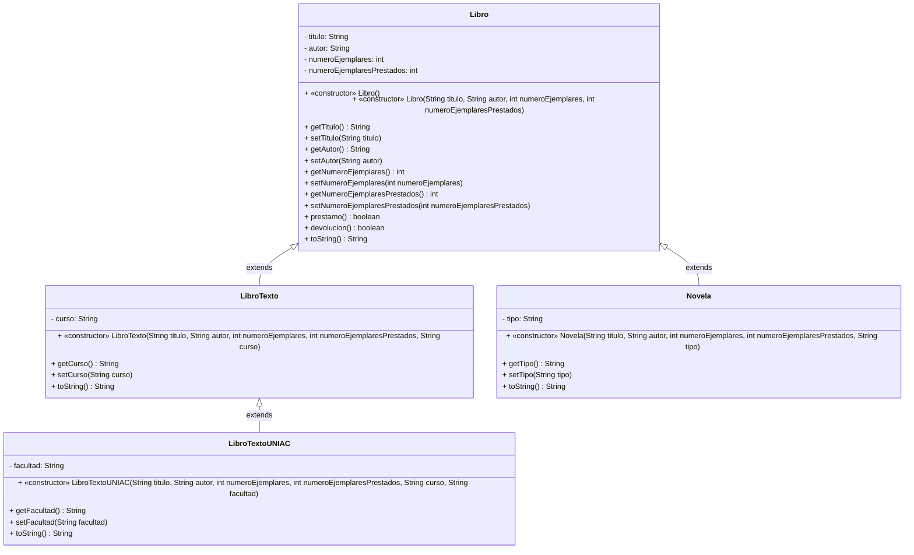

# Parcial I - Parte practica G412

### Integrantes:
- **Jean Paul Rojas Herrera**
- **Michael Dowglas Lenis Chaguendo**

## Diagrama de Clases (Mermaid)



## Dos situaciones donde NO sería posible la herencia:

**Situación 1 - Atributos privados:** Los atributos de Libro son private, lo que significa que las clases hijas no pueden acceder directamente a ellos, solo a través de los getters y setters. 

```
// Esto fallaría en LibroTexto:
public String toString() {
    return titulo; // ERROR: titulo es private en Libro
}
// Debe hacerse así:
    return getTitulo(); // Correcto, usando el getter
```

**Situación 2 — Si la clase fuera final:** Si Libro estuviera declarada como final, ninguna clase podría heredar de ella. 

```
public final class Libro { // Con esto, LibroTexto, Novela, etc. NO podrían existir
}
```

## Dos nuevos atributos y un método adicional con sentido:

```
// En clase Libro: fecha de publicación y editorial
private int anioPublicacion;
private String editorial;

// Getters y setters correspondientes...

// Método adicional: verificar si el libro es antiguo (más de 20 años)
public boolean esLibroAntiguo() {
    int anioActual = java.time.Year.now().getValue();
    return (anioActual - anioPublicacion) > 20;
}
```

Estos tienen sentido porque una biblioteca real siempre cataloga el año de publicación y la editorial, y saber si un libro es antiguo puede ser útil para decisiones de adquisición de nuevas copias.